# Control Center Util
Control center util repository is used to initiate the creation of a control center. This repository contains the utility scripts to run the terragrunt scripts for creating a control center. 

https://github.com/mojaloop/control-center-util

This repo builds a docker image which can be used to invoke the utility scripts and initiate the control center creation. 

## Control Center Dockerfile 

It installs all required prerequisites for running the control center util code. Also it installs terraform, terragrunt, ansible. Installs specific Python packages using pip, including Ansible, netaddr, awscli, openshift and setuptools. Installs the 'community.kubernetes' Ansible Galaxy collection. And it copies the whole content of control-center-util repo to the container file system.

First of all get the tty of the running container using the below command

## Prerequisites for creating control center

AWS account credentials should be configured to run the terragrunt scripts and create aws resources.

A route 53 registered domain to use in the configurations.

## Steps to create control center

        docker run -it -v ~/.aws:/root/.aws ghcr.io/mojaloop/control-center-util:0.10.1 /bin/bash

Change directory to iac-run-dir 

        cd /iac-run-dir

Modify below environment variables in setenv as appropriate

        export AWS_PROFILE=oss
        export PRIVATE_REPO_TOKEN=nullvalue
        export PRIVATE_REPO_USER=nullvalue
        export ANSIBLE_BASE_OUTPUT_DIR=$PWD/output
        export IAC_TERRAFORM_MODULES_TAG=v0.9.11
        export PRIVATE_REPO=example.com

Then source sentenv and run init.sh that clones the iac-modules repo and checkout the stable version of the code ( gets from IAC_TERRAFORM_MODULES_TAG)

        source setenv
        ./init.sh

Then change the directory to 

        cd /iac-run-dir/iac-modules/terraform/control-center/init

Then edit environment.yaml file as required that initially looks like 

        region: eu-west-1
        domain: mojaloop.live
        tenant: labsten106
        enable_github_oauth: false
        enable_netmaker_oidc: true
        ansible_collection_tag: v0.19.3-dextest6
        gitlab_admin_rbac_group: tenant-admins
        gitlab_readonly_rbac_group: tenant-viewers
        smtp_server_enable: false
        gitlab_version: 16.0.5
        gitlab_runner_version: 16.0.2
        iac_group_name: iac_admin
        netmaker_version: 0.18.7
        letsencrypt_email: test@mojalabs.io
        delete_storage_on_term: true
        envs:
          - env: dev
            domain: labsk8s2027.mojaloop.live
            enable_vault_oauth_to_gitlab: true
            enable_grafana_oauth_to_gitlab: true
            enable_argocd_oauth_to_gitlab: true
          - env: test
            domain: labsk8s2037.mojaloop.live
            enable_vault_oauth_to_gitlab: true
            enable_grafana_oauth_to_gitlab: true
            enable_argocd_oauth_to_gitlab: true
        tags:
        {
            "Origin": "Terraform",
            "mojaloop/cost_center": "mlf-iac-sandbox",
            "mojaloop/env": "ft-sbox-rw",
            "mojaloop/owner": "Samuel-Kummary",
        }

Run the following to set the below env variables

        source setlocalenv.sh
that sets

        export IAC_TEMPLATES_TAG=$IAC_TERRAFORM_MODULES_TAG
        export CONTROL_CENTER_CLOUD_PROVIDER=aws

## Run terragrunt apply

Run the following to invoke terragrunt script
        ./runall.sh

the above one runs below terragrunt script

        Terragrunt run-all init
        Terragrunt run-all apply --terragrunt-exclude-dir control-center-post-config --terragrunt-non-interactive 

Since the backend is configured as local the terraform state files will be stored in the local file system.

        remote_state {
        backend = "local"
        config = {
            path = "${get_parent_terragrunt_dir()}/${path_relative_to_include()}/terraform.tfstate"
        }

        generate = {
            path = "backend.tf"
            if_exists = "overwrite"
        }
        }

Let us have a look at what all Terragrunt configurations and terraform modules get executed when Terragrunt apply happens from local server. 

### control-center-deploy 

        terraform {
        source = "git::https://github.com/mojaloop/iac-modules.git//terraform/${get_env("CONTROL_CENTER_CLOUD_PROVIDER")}/control-center-infra?ref=${get_env("IAC_TERRAFORM_MODULES_TAG")}"
        }

It creates the base infra, ec2 instances for GitLab and Docker server, Load balancer targetting Docker server, DNS records required for services installed on these instances etc.

#### Invokes base_infra module to create the following resources

1. VPC, subnets, security groups of bastion instance for SSH access, wire guard UDP communication, bastion egress traffic, along with bastion instance. 
2. Netmaker VPC, netmaker subnets, security groups with rules and Netmaker instance 
3. Route53 resources - private zone, public zone, cluster_parent zone, nameserver records, a record for bastion ip with name “Haproxy”

#### Invokes post-config-control-center module 

1. It creates an AWS Identity and Access Management (IAM) role, an IAM role policy, and an AWS Data Lifecycle Manager (DLM) lifecycle policy for managing snapshots of Amazon Elastic Block Store (EBS) volumes, specifically for GitLab.
2. Invokes terraform module to provision Simple Email Service on AWS

#### Creates the ec2 instance for hosting GitLab 

1. Creates the instance profile, role, and IAM user for the GitLab ec2 instance
2. Creates the ec2 instance for hosting the GitLab server integrating the IAM instance profile. Also integrates the SSH key pair created in base infra 
3. Places the instance in the subnet created in base infra
4. Configures an additional block device apart from the root volume 
   
#### Creates the ec2 instance for hosting docker and other related containers

1. Configures an additional EBS block device attached to the instance.
2. Associates the instance with the specified security group defined in aws_security_group.docker_server

#### Loadbalancer resources

It creates an AWS Network Load Balancer (NLB) for internal traffic, an SSL listener for HTTPS traffic, a target group for the Vault service running on the Docker server, and a wildcard SSL certificate for securing the traffic

#### Route53 resources

* GitLab Server Public DNS Record:
Creates a CNAME record for the GitLab server's public DNS.
Associates with the public DNS of the GitLab server instance.

* Public Netmaker DNS Zone:
Creates a Route 53 DNS zone for Netmaker

* Public Netmaker NS Records (aws_route53_record.public_netmaker_ns):
Creates NS records for the Netmaker DNS zone.

* Netmaker Dashboard, API, Broker, Stun DNS Records:
Creates A records for Netmaker services (dashboard, API, broker, stun).

* Nexus Server Private DNS Record:
Creates an A record for the Nexus server with the private IP of the Docker server.

* minio Server Private DNS Record:
Creates an A record for the minio server with the private IP of the Docker server.

* Vault Server Private DNS Record (aws_route53_record.vault_server_private):
Creates a CNAME record for the Vault server with the internal DNS name of the internal NLB.
Associates with the internal DNS name of the internal NLB.

* GitLab Runner Server Private DNS Record (aws_route53_record.gitlab_runner_server_private):
Creates an A record for the GitLab Runner server with the private IP of the Docker server.

#### Security Group Resources

 Creates the AWS security groups for the GitLab and Docker servers

#### Output variables of control-center-deploy 

* Iac_user_key_id and iac_user_secret_key_id for iac user for gitlab-ci
* GitLab Server Outputs:
    * GitLab Root Password, GitLab Root Token, GitLab S3 Access Key, GitLab S3 Access Secret, Admin S3 Access Key, Admin S3 Access Secret, Nexus Admin Password - These are randomly generated values
    * GitLab Server Hostname - aws_route53_record.gitlab_server_public.fqdn
* Bastion Server Outputs: 
    * Bastion SSH Key - module.base_infra.ssh_private_key
    * Bastion Public IP - module.base_infra.bastion_public_ip
    * Bastion OS Username
* Docker Server Outputs:
    * Nexus Docker Repo Listening Port
    * Minio S3 Listening Port
    * minio FQDN - aws_route53_record.minio_server_private.fqdn ( private ip of docker server)
    * Vault Listening Port
    * Vault FQDN - aws_route53_record.vault_server_private.fqdn - aws_lb.internal.dns_name - NLB 
    * Docker host variable map 
  <!-------->
                ansible_hostname                 = aws_route53_record.gitlab_runner_server_private.fqdn
                gitlab_server_hostname           = aws_route53_record.gitlab_server_public.fqdn
                gitlab_runner_version            = var.gitlab_runner_version
                minio_s3_server_host         = aws_route53_record.minio_server_private.fqdn
                minio_s3_listening_port      = var.minio_s3_listening_port
                minio_s3_admin_user          = "admin"
                minio_s3_admin_access_key    = random_password.admin_s3_access_key.result
                minio_s3_admin_secret_key    = random_password.admin_s3_access_secret.result
                minio_s3_gitlab_user         = "gitlab"
                minio_s3_gitlab_access_key   = random_password.gitlab_s3_access_key.result
                minio_s3_gitlab_secret_key   = random_password.gitlab_s3_access_secret.result
                nexus_admin_password             = random_password.nexus_admin_password.result
                nexus_docker_repo_listening_port = var.nexus_docker_repo_listening_port
                docker_extra_volume_name         = "docker-extra"
                docker_extra_vol_mount           = true
                docker_extra_ebs_volume_id       = aws_instance.docker_server.ebs_block_device.*.volume_id[0]
                docker_extra_volume_size_mb      = aws_instance.docker_server.ebs_block_device.*.volume_size[0] * 1074
                vault_listening_port             = var.vault_listening_port
                vault_fqdn                       = aws_route53_record.vault_server_private.fqdn
                vault_gitlab_token               = random_password.gitlab_root_token.result
    * Bastion host variable map
  <!-------->
                netmaker_api_host       = aws_route53_record.netmaker_api[0].name
                netmaker_image_version  = var.netmaker_image_version
                ansible_ssh_common_args = "-o StrictHostKeyChecking=no"
                egress_gateway_cidr     = var.vpc_cidr
                netmaker_master_key     = random_password.netmaker_master_key.result
    * Netmaker host variable map
  <!-------->
                netmaker_base_domain          = aws_route53_record.public_netmaker_ns[0].name
                netmaker_server_public_ip     = module.base_infra.netmaker_public_ip
                netmaker_master_key           = random_password.netmaker_master_key.result
                netmaker_mq_pw                = random_password.netmaker_mq_pw.result
                netmaker_admin_password       = random_password.netmaker_admin_password.result
                netmaker_oidc_issuer          = "https://${aws_route53_record.gitlab_server_public.fqdn}"
                netmaker_control_network_name = var.netmaker_control_network_name
                ansible_ssh_common_args       = "-o StrictHostKeyChecking=no"
    * All host variable map
  <!--------->
                ansible_ssh_user       = var.os_user_name
                ansible_ssh_retries    = "10"
                base_domain            = local.base_domain
                gitlab_external_url    = "https://${aws_route53_record.gitlab_server_public.fqdn}"
                netmaker_image_version = var.netmaker_image_version

### ansible-cc-deploy

        terraform {
        source = "git::https://github.com/mojaloop/iac-modules.git//terraform/ansible/control-center-deploy?ref=${get_env("IAC_TERRAFORM_MODULES_TAG")}"
        }

The source is ansible/control-center-deploy module 

The inputs to the module are 

        inputs = {
        gitlab_hosts                = dependency.control_center_deploy.outputs.gitlab_hosts
        docker_hosts                = dependency.control_center_deploy.outputs.docker_hosts
        bastion_hosts               = dependency.control_center_deploy.outputs.bastion_hosts
        bastion_hosts_var_maps      = dependency.control_center_deploy.outputs.bastion_hosts_var_maps
        docker_hosts_var_maps       = dependency.control_center_deploy.outputs.docker_hosts_var_maps
        gitlab_hosts_var_maps       = dependency.control_center_deploy.outputs.gitlab_hosts_var_maps
        all_hosts_var_maps          = dependency.control_center_deploy.outputs.all_hosts_var_maps
        ansible_bastion_key         = dependency.control_center_deploy.outputs.bastion_ssh_key
        ansible_bastion_os_username = dependency.control_center_deploy.outputs.bastion_os_username
        ansible_bastion_public_ip   = dependency.control_center_deploy.outputs.bastion_public_ip
        ansible_collection_tag      = local.env_vars.ansible_collection_tag
        ansible_base_output_dir     = get_env("ANSIBLE_BASE_OUTPUT_DIR")
        }

The following ansible-playbook gets executed

        ansible-playbook mojaloop.iac.control_center_deploy -i ${local_sensitive_file.ansible_inventory.filename}

### control_center_deploy ansible-playbook

      - hosts: bastion
        become: true
        roles:
          - mojaloop.iac.bastion_common

      - hosts: docker
        become: true
        roles:
          - mojaloop.iac.gitlab_common
          - mojaloop.iac.docker
          - mojaloop.iac.nexus_server
          - mojaloop.iac.minio

      - hosts: gitlab
        become: true
        roles:
          - mojaloop.iac.gitlab_common
          - mojaloop.iac.gitlab_server

      - hosts: docker
        become: true
        roles:
          - mojaloop.iac.gitlab_ci

##### Bastion common role on bastion node

* Uploads SSH key to root home
* Updates apt cache 
* Installs Python and its dependencies

##### Gitlab common role on docker node

* Sets the hostname as the GitLab DNS name
* Install Python3-pip

##### Docker role on docker node

* Update apt cache: Ensures that the package manager's cache is up-to-date.
* Install dependencies: Installs Docker and Docker Compose.
* Enable and start Docker service: Ensures that the Docker service is enabled to start on boot and start the Docker service.
* Start and enable containerd daemon: Ensures that the containerd daemon is started and enabled to start on boot.
* Add a cron job for Docker cleanup: Adds a cron job to run Docker cleanup commands weekly.
* List Linux block devices and store EBS volume device name: Lists Linux block devices, identifies the device associated with the docker_extra_ebs_volume_id passed as input, and stores it for later use.
* Create ext4 filesystem for extra volume: creates an ext4 filesystem on the specified device.
* Create Docker volume: Creates a Docker volume using the specified name and driver options. The volume is associated with the ext4 filesystem created earlier.

##### Nexus-server role on docker node

* Pulls nexus docker image, creates docker volumes
* Creates nexus docker container attaching the docker volume
* Wait for Nexus container to respond: Uses the uri module to repeatedly check the Nexus status endpoint until a successful response (status code 200) is received. This is achieved using the until loop with a maximum of 30 retries, each delayed by 10 seconds.
* Check if admin password file exists: Uses the stat module to check if the admin password file exists in the specified Docker volume.
* Find admin password: Uses the shell module to retrieve the admin password from the specified Docker volume if the file exists.
* Output old admin password: Uses the debug module to display the old admin password.
* Change admin password if needed: Uses the uri module to change the admin password if the old admin password file exists. It sends a PUT request to the Nexus API with the new admin password.
* Add Docker proxy repositories if they do not exist using the list of proxies ansible input variable : Uses the uri module to add Docker proxy repositories in Nexus if they do not exist. It sends a POST request with the necessary information.
* Add Helm proxy repositories if they do not exist: Similar to Docker repositories, it adds Helm proxy repositories in Nexus if they do not exist.
* Add Docker group repository if it does not exist: Adds a Docker group repository in Nexus and groups all docker registries to it.
* Set active realms: Uses the uri module to set the active realms in Nexus by sending a PUT request with the necessary information.
* Set anonymous access: Uses the uri module to set anonymous access in Nexus by sending a PUT request with the necessary information.

##### Minio role on docker node

* This ansible role installs and runs the minio server
* It configures a minio client , creates minio user and access policy for gitlab. 
* It creates empty buckets ["gitlab-registry", "gitlab-artifacts", "gitlab-external-diffs", "gitlab-lfs-objects", "gitlab-uploads", "gitlab-packages", "gitlab-dependency-proxy", "gitlab-terraform-state", "gitlab-registry", "gitlab-pages"] for gitlab

##### Gitlab common role on gitlab node

* Sets the hostname as the GitLab DNS name
* Install Python3-pip
  
##### Gitlab server role on gitlab node

* Set Postfix (Mail Transfer Agent) Options as it is recommended to have a mail transfer agent (MTA) installed on the server where GitLab is running. This is to support the email notifications and other email-related functionalities provided by GitLab
  * Configures Postfix options using the debconf module.
  * Sets the mailname and main_mailer_type for the Postfix mail server.

* Install Dependencies:
  * Installs necessary packages like curl, openssh-server, ca-certificates, and postfix.

* Install boto3/botocore:
  * Uses the pip module to install Python packages boto3 and botocore with specified versions.

* List Linux block devices, find a block device and create an EXT4 filesystem for backups

* Mount Backup Volume

* Install GitLab Repository:
  * Uses the get_url module to download a script for installing the GitLab repository.
  * Executes the GitLab repository script using the shell module.

* Install GitLab EE:
  * Uses the package module to install GitLab EE with a specified version.

* Configure GitLab:
  * The playbook uses the template module to render a Jinja2 template (gitlab.rb.j2) and places the resulting configuration file (/etc/gitlab/gitlab.rb).
  * This configuration file contains various GitLab settings like registry_storage, SMTP settings, object storage etc
  * Minio URL, username, password etc are configured in this file to set up the object storage and registry storage of GitLab 

* Start GitLab:
  * The command module is used to execute gitlab-ctl reconfigure, which applies the GitLab configuration changes.

* Disable GitLab Auto Signup:
  * The command module disables the GitLab auto-signup feature.

* Retrieves and Register GitLab Runner Shared Token:
  * The playbook retrieves the shared token for GitLab Runners by running a specific command using gitlab-rails runner.
  * The shared runner token is saved as a fact (gitlab_shared_runner_token) for later use in the playbook.

* Create Root Password and Token Ruby File:
  * A Ruby file (setrootpassword.rb.j2) is rendered using the template module and placed in /etc/gitlab/setrootpassword.rb.
  * This task involves setting up or updating the root user's password and token for GitLab.

* Setup Backups:
  * Another Jinja2 template (backups.j2) is rendered and placed in /etc/cron.daily/backups.
  * This task involves configuring backup-related settings for GitLab.

##### Gitlab ci role on docker node

* Add gitlab-runner user to the docker group:
  * The user module adds the gitlab-runner user to the docker group, creating the user's home directory and setting the shell.

* Downloads and runs GitLab repository script

* Install the GitLab Runner package with a specified version.

* Set gitlab-runner to auto-restart:

* Creates a directory for additional systemd configuration for the gitlab-runner service.

* Deploy gitlab-runner kill conf file: 
  * Renders a template (kill.conf.j2) and places it in the /etc/systemd/system/gitlab-runner.service.d/ directory. 
  * The TimeoutStopSec in kill.conf mentions the time period to perform cleanup and shut down gracefully before it is forcefully terminated with the specified KillSignal

* Downloads CA certificate from GitLab server and saves it in the runner.
* Start gitlab runner using gitlab-runner start command

* Get registered runners:
  * Checks the number of registered runners by counting occurrences in the GitLab Runner configuration.

* Register runners:
  * Registers GitLab Runners if they do not already exist.
  * Uses the gitlab-runner register command with various options, including Docker executor settings and S3 cache configuration.

* Changes the concurrent parameter in the gitlab-runner/config.toml configuration file for limiting how many jobs globally can be run concurrently

### control-center-pre-config 

<!---->
        terraform {
        source = "git::https://github.com/mojaloop/iac-modules.git//terraform/config-params/control-center-pre-config?ref=${get_env("IAC_TERRAFORM_MODULES_TAG")}"
        }

The module invocation is dependent on ansible-cc-deploy and control-center-deploy. Below are the inputs 

    inputs = {
        iac_user_key_secret              = dependency.control_center_deploy.outputs.iac_user_key_secret
        iac_user_key_id                  = dependency.control_center_deploy.outputs.iac_user_key_id
        gitlab_admin_rbac_group          = local.env_vars.gitlab_admin_rbac_group
        gitlab_readonly_rbac_group       = local.env_vars.gitlab_readonly_rbac_group
        enable_netmaker_oidc             = local.env_vars.enable_netmaker_oidc
        netmaker_oidc_redirect_url       = dependency.control_center_deploy.outputs.netmaker_oidc_callback_url
        minio_s3_listening_port          = dependency.control_center_deploy.outputs.minio_s3_listening_port
        nexus_docker_repo_listening_port = dependency.control_center_deploy.outputs.nexus_docker_repo_listening_port
        minio_fqdn                       = dependency.control_center_deploy.outputs.minio_fqdn
        nexus_fqdn                       = dependency.control_center_deploy.outputs.nexus_fqdn
        tenant_vault_listening_port      = dependency.control_center_deploy.outputs.tenant_vault_listening_port
        vault_fqdn                       = dependency.control_center_deploy.outputs.vault_fqdn
        private_repo_user                = get_env("PRIVATE_REPO_USER")
        private_repo_token               = get_env("PRIVATE_REPO_TOKEN")
        private_repo                     = get_env("PRIVATE_REPO")
        iac_templates_tag                = get_env("IAC_TEMPLATES_TAG")
        iac_terraform_modules_tag        = get_env("IAC_TERRAFORM_MODULES_TAG")
        control_center_cloud_provider    = get_env("CONTROL_CENTER_CLOUD_PROVIDER")
        }
In summary, this module creates the GitLab group named 'iac', the GitLab project 'bootstrap', couple of Gitlab applications for OIDC sign-on for Vault and Netmaker etc.

#### GitLab resources

* GitLab Groups:
  * gitlab_admin_rbac_group: A GitLab group for admin RBAC.
  * gitlab_readonly_rbac_group: A GitLab group for read-only RBAC.
  * iac: A GitLab group named "iac."

* GitLab Projects:
  * bootstrap: A GitLab project named "bootstrap" under the "iac" group.

* GitLab Project Variables associated with bootstrap project:
  * iam_user_key_id, iam_user_key_secret, iac_templates_tag, iac_terraform_modules_tag, control_center_cloud_provider: Variables associated with the "bootstrap" project.

* GitLab Group Variables associated with "iac" group:
  * private_repo_user, private_repo, bootstrap_project_id, private_repo_token, nexus_fqdn, nexus_docker_repo_listening_port, minio_fqdn, minio_s3_listening_port, vault_fqdn tenant_vault_listening_port

* GitLab Applications:
  * netmaker_oidc: An OIDC application named "netmaker_oidc"
  * tenant_vault_oidc: An OIDC application named "tenant_vault_oidc" 

#### Output variables in control-center-pre-config 

* netmaker_hosts_var_maps variable:
  * netmaker_oidc_client_id: Exposes the client ID of the netmaker_oidc GitLab OIDC application
  * netmaker_oidc_client_secret: Exposes the client secret of the netmaker_oidc GitLab OIDC application 

* docker_hosts_var_maps variable:
  * vault_oidc_client_id: Exposes the client ID of the tenant_vault_oidc GitLab OIDC application 
  * vault_oidc_client_secret: Exposes the client secret of the tenant_vault_oidc GitLab OIDC application

* gitlab_bootstrap_project_id: Exposes the ID of the "bootstrap" GitLab project.

* bootstrap_project_id: Exposes the ID of the "bootstrap" GitLab project.

* iac_group_id: Exposes the ID of the "iac" GitLab group.

### ansible-cc-post-deploy 

        terraform {
        source = "git::https://github.com/mojaloop/iac-modules.git//terraform/ansible/control-center-post-deploy?ref=${get_env("IAC_TERRAFORM_MODULES_TAG")}"
        }

This module invocation is dependent on control_center_deploy and control_center_pre_config

Inputs to this module invocation are 

      inputs = {
        bastion_hosts          = dependency.control_center_deploy.outputs.bastion_hosts
        netmaker_hosts         = dependency.control_center_deploy.outputs.netmaker_hosts
        docker_hosts           = dependency.control_center_deploy.outputs.docker_hosts
        bastion_hosts_var_maps = dependency.control_center_deploy.outputs.bastion_hosts_var_maps
        netmaker_hosts_var_maps = merge(dependency.control_center_deploy.outputs.netmaker_hosts_var_maps,
        dependency.control_center_pre_config.outputs.netmaker_hosts_var_maps)
        docker_hosts_var_maps = merge(dependency.control_center_deploy.outputs.docker_hosts_var_maps,
        dependency.control_center_pre_config.outputs.docker_hosts_var_maps)
        all_hosts_var_maps          = dependency.control_center_deploy.outputs.all_hosts_var_maps
        enable_netmaker_oidc        = local.env_vars.enable_netmaker_oidc
        ansible_bastion_key         = dependency.control_center_deploy.outputs.bastion_ssh_key
        ansible_bastion_os_username = dependency.control_center_deploy.outputs.bastion_os_username
        ansible_bastion_public_ip   = dependency.control_center_deploy.outputs.bastion_public_ip
        ansible_collection_tag      = local.env_vars.ansible_collection_tag
        ansible_base_output_dir     = get_env("ANSIBLE_BASE_OUTPUT_DIR")
        env_map                     = local.env_map
        }

### ansible/control-center-post-deploy

          ansible-galaxy collection install ${var.ansible_collection_url},${var.ansible_collection_tag}
          ansible-playbook mojaloop.iac.control_center_post_deploy -i ${local_sensitive_file.ansible_inventory.filename}

Control_center_post_deploy ansible-playbooks contains the below 

      - hosts: netmaker
        become: true
        roles:
          - mojaloop.iac.docker
          - mojaloop.iac.netmaker

      - hosts: bastion
        become: true
        roles:
          - mojaloop.iac.netclient

      - hosts: docker
        become: true
        roles:
          - mojaloop.iac.vault

#### docker role on netmaker instance 

* Update apt cache: Ensures that the package manager's cache is up-to-date.
* Install dependencies: Installs Docker and Docker Compose.
* Enable and start Docker service: Ensures that the Docker service is enabled to start on boot and start the Docker service.
* Start and enable containerd daemon: Ensures that the containerd daemon is started and enabled to start on boot.
* Add a cron job for Docker cleanup: Adds a cron job to run Docker cleanup commands weekly.
* List Linux block devices and store EBS volume device name: Lists Linux block devices, identifies the device associated with the docker_extra_ebs_volume_id passed as input, and stores it for later use.
* Create ext4 filesystem for extra volume: creates an ext4 filesystem on the specified device.
* Create Docker volume: Creates a Docker volume using the specified name and driver options. The volume is associated with the ext4 filesystem created earlier.

#### netmaker role on netmaker instance 

* Update apt cache:

* Install WireGuard:
  * Uses the Ansible package module to install the WireGuard package.

* Create a directory for the Netmaker project:
  * Uses the Ansible file module to create a directory with specified attributes.

* Deploy systemd service for Netmaker:
  * Uses the Ansible template module to deploy a systemd service file for Netmaker.

* Deploy Netmaker Docker Compose file:
  * Uses the Ansible template module to deploy a Docker Compose file for Netmaker.
  * Generated docker-compose file looks like below:
<!---->
        version: "3.4"

        services:
        netmaker: # The Primary Server for running Netmaker
            container_name: netmaker
            image: gravitl/netmaker:v0.18.7
            restart: always
            volumes: # Volume mounts necessary for sql, coredns, and mqtt
            - dnsconfig:/root/config/dnsconfig
            - sqldata:/root/data
            - shared_certs:/etc/netmaker
            environment: # Necessary capabilities to set iptables when running in container
            BROKER_ENDPOINT: "wss://broker.netmaker.ctrlcenter.moja-onprem.net"
            STUN_LIST: "stun.netmaker.ctrlcenter.moja-onprem.net:3478"
            SERVER_NAME: "broker.netmaker.ctrlcenter.moja-onprem.net" # The domain/host IP indicating the mq broker address
            SERVER_HOST: "34.245.104.203" # Set to public IP of machine.
            ports:
            - "3478:3478/udp" # the stun port
        netmaker-ui:  # The Netmaker UI Component
            container_name: netmaker-ui
            image: gravitl/netmaker-ui:v0.18.7
            depends_on:
            - netmaker
            links:
            - "netmaker:api"
            restart: always
            environment:
            BACKEND_URL: "https://api.netmaker.ctrlcenter.moja-onprem.net" # URL where UI will send API requests. Change based on SERVER_HOST, SERVER_HTTP_HOST, and API_PORT
        caddy: # The reverse proxy that manages traffic for Netmaker
            image: caddy:2.6.2
            container_name: caddy
            restart: unless-stopped
            volumes:
            - /root/netmaker-compose/Caddyfile:/etc/caddy/Caddyfile # Config file for Caddy
            - caddy_data:/data
            - caddy_conf:/config
            ports:
            - "80:80"
            - "443:443"
        coredns:
            container_name: coredns
            image: coredns/coredns
            command: -conf /root/dnsconfig/Corefile
            depends_on:
            - netmaker
            restart: always
            volumes:
            - dnsconfig:/root/dnsconfig
        mq: # the mqtt broker for netmaker
            container_name: mq
            image: eclipse-mosquitto:2.0.15-openssl
            depends_on:
            - netmaker
            restart: unless-stopped
            command: ["/mosquitto/config/wait.sh"]
            environment:
            MQ_PASSWORD: "rVOJo_SRBsTiQ0gbWFcw6rz39KLhAf" # must be same value as in netmaker env
            MQ_USERNAME: "nmmq_admin" # must be same value as in netmaker env
            volumes:
            - /root/netmaker-compose/mosquitto.conf:/mosquitto/config/mosquitto.conf
            - /root/netmaker-compose/wait.sh:/mosquitto/config/wait.sh
            - mosquitto_logs:/mosquitto/log
            ports:
            - "1883:1883"
            - "8883:8883"
        volumes:
        caddy_data: {} # runtime data for caddy
        caddy_conf: {} # configuration file for Caddy
        shared_certs: {} # netmaker certs generated for MQ comms - used by nodes/servers
        sqldata: {} # storage for embedded sqlite
        dnsconfig: {} # storage for coredns
        mosquitto_logs: {} # storage for mqtt logs

  * Netmaker ( primary serer for running netmaker ), netmaker-ui ( ui component ), caddy ( reverse proxy which manages the traffic ), mosquitto ( mqtt broker for netmaker) are the containers running as part of netmaker docker-compose 

* Deploy Mosquitto configuration file:

* Deploy Caddy configuration file:

* Set Netmaker to auto-restart:

* Install nmctl ( netmaker ctl tool)

* Waits for the Netmaker API server to respond by sending a GET request to the /api/networks endpoint.

* Adds an admin user by sending a POST request to the /api/users/{{ netmaker_admin_username }} endpoint.
* The request includes a JSON body generated from a template (createadminuser.json.j2)
* The template looks like below 
<!---->
        {
        "isadmin": true,
        "networks": [
            "*"
        ],
        "password": "{{ netmaker_admin_password }}",
        "username": "{{ netmaker_admin_username }}"
        }

* Add Networks:
  * It adds networks if they don't exist by sending a POST request to the /api/networks endpoint.
  * The request includes a JSON body generated from a template (createnetwork.json.j2).
  * The playbook uses a loop to iterate over the netmaker_networks list.
<!---->
        netmaker_networks:
        - "network_name": "cntrlctr"
            "node_keys":
            - "ops"
        - "network_name": "awsdev"
            "node_keys":
            - "k8s"
        - "network_name": "dev1"
            "node_keys":
            - "k8s"
  * Value of netmaker_networks is passed from the ansible.tf in control-center-post deploy ; it is resulted by a merge of base_network_list and environment network list that is originated from environment.yaml file. When it gets executed from the 

* It retrieves enrollment keys by sending a GET request to the /api/v1/enrollment-keys endpoint.

* Add Key for Control Network:
   * It adds keys for the control network for Netclient by sending a POST request to the /api/v1/enrollment-keys endpoint.
   * The request includes a JSON body generated from a template (createkey.json.j2, shown below).
<!---->
        {
            "tags":["{{ item.0.network_name }}-{{ item.1 }}"],
            "networks":["{{ item.0.network_name }}"],
            "expiration":0,
            "unlimited":true,
            "uses_remaining":0
        }
   * The playbook uses a loop to iterate over the netmaker_networks list, specifically over the node_keys subelement.
   * It adds key when the key with the same tag does not exist
   * tags value become [contrlctr-ops] in first case , [awsdev-k8s] in second

* Get Keys Again: It retrieves enrollment keys again after adding keys for the control network.

* Copy Keys: It copies the content of the second key response to a file specified by netmaker_enrollment_key_list_file_location to ansible control node. 

#### netclient role on bastion 

* Installs Netclient GPG Key:
  * Downloads the GPG key from https://apt.netmaker.org/gpg.key.
  * Places the GPG key in the trusted GPG keys directory /etc/apt/trusted.gpg.d/netclient.asc.

* Installs Netclient Package Repository:
  * Downloads the Netclient package repository configuration from https://apt.netmaker.org/debian.deb.txt.
  * Places the repository configuration in the /etc/apt/sources.list.d/netclient.list file.

* Update Apt Cache

* Installs the WireGuard package.

* Set Token from Local File:
  * Reads enrollment tokens from a local file specified by netmaker_enrollment_key_list_file_location, created by the netmaker role. 
  * netclient_enrollment_keys value is [cnctlctr-ops]
  * so it gets the netmaker join token of control center network

    - name: set token from local file
      vars:
        query: "[?tags[0]=='{{ item }}'].token"
      set_fact:
        netmaker_join_tokens: "{{ netmaker_join_tokens + [lookup('file', netmaker_enrollment_key_list_file_location) | from_json | json_query(query) | first] }}"
      when: "not netmaker_join_tokens"
      loop: "{{ netclient_enrollment_keys }}"
* Bastion joins the control center network using the netmaker_join_token obtained in the above step
* Iptable accept on forward: this task effectively allows the forwarding of packets between network interfaces on the system. Here the bastion node is functioning as a router or gateway, allowing traffic to be forwarded between different network segments 
* Creates an egress gateway on bastion node mentioning the vpc_cidr as the allowed cidr range. 
  
#### vault role on docker

* Creates Directory for Project at  {{ vault_root_dir }}/vaultbuild
* Deploys Vault Dockerfile to {{ vault_root_dir }}/vaultbuild/Dockerfile based on a template and triggers a restart of the Vault service.
* Deploys Systemd Service:  Deploys a Systemd service file for managing the Vault service and triggers a restart of the Vault service.
* Deploys Init Script and triggers a restart of the service; Init script does the following 
  * Initialize and Unseal Vault:
  * Check if Vault is initialized.
  * If not initialized, run vault operator init to initialize with one key share and threshold.
  * Unseal Vault using the unseal key from the initialization output.
  * Parse the root token from the initialization output.
  * Check if the root token is already stored in GitLab. If not present, store the root token in GitLab as a project variable in the bootstrap project. 
  * Retrieve the unseal key from the initialization output.
  * Check if the unseal key is already stored in GitLab. If not present, store the unseal key in GitLab as a project variable in the bootstrap project. 

* Deploys the Vault configuration file (vault-config.hcl) and triggers a restart of the Vault service.
* Deploy Docker Compose File to {{ vault_root_dir }}/docker-compose.yml using a template
* An example docker-compose file geneated
  version: '3.6'

        services:
        vault:
            image: hashicorp/vault:1.13
            container_name: vault
            restart: on-failure:10
            ports:
            - "8200:8200"
            cap_add:
            - IPC_LOCK
            environment:
            VAULT_ADDR: "http://0.0.0.0:8200"
            volumes:
            - vault-volume:/vault/file
            - /root/vault-compose/vault-config.hcl:/vault/config/vault-config.hcl
            networks:
            vault-network:
                ipv4_address: 172.21.0.10
                aliases:
                - vault-server
            command: server
        vault-client:
            build: ./vaultbuild
            depends_on:
            - vault
            environment:
            VAULT_ADDR: "http://vault-server:8200"
            GITLAB_URL: "https://gitlab.ctrlcenter.moja-onprem.net/api/v4/projects/1/variables"
            GITLAB_TOKEN: "w3bn9BdGzB3M3PKkRp3A"
            networks:
            vault-network:
                ipv4_address: 172.21.0.20
                aliases:
                - vault-client
* Set the service to auto-restart mode
Until this part, we have seen the code execution initiated by the terragrunt run-all apply. 
Then, go to the GitLab instance, and use the root password found by running:

        yq eval '.gitlab.vars.server_password'  $ANSIBLE_BASE_OUTPUT_DIR/control-center-deploy/inventory

You then need to set up 2FA, then you can navigate to the bootstrap project and view pipelines in CICD section.

## Move the terraform state to GitLab 
Run the below script to move the state to GitLab

        ./movestatetogitlab.sh

* The script migrates the state from local to GitLab storage. 

        terragrunt run-all init -migrate-state -force-copy

* It clones the bootstrap project from GitLab, then copies the required content from iac-modules/control-center/init directory to bootstrap cloned directory/

        cp -r control-center-deploy/ control-center-pre-config/ control-center-post-config/ ansible-cc-deploy/ ansible-cc-post-deploy/ environment.yaml terragrunt.hcl *-vars.yaml $TMP_GITLAB_DIR

* It copies the related files for setting up the CICD files 
    
        cp -r terraform/gitlab/ci-templates/bootstrap/. $TMP_GITLAB_DIR

* It pushes these content to bootstrap project

## Login to Netmaker 

Netmaker gui is available at dashboard.NM_SUBDOMAIN where NM_SUBDOMAIN is:

      yq eval '.netmaker.vars.netmaker_base_domain'  /iac-run-dir/output/control-center-post-config/inventory

Admin user defaults to nmaker-admin, password is:

      yq eval '.netmaker.vars.netmaker_admin_password'  /iac-run-dir/output/control-center-post-config/inventory

OIDC integration is preconfigured for netmaker using gitlab as a provider. A gitlab user can use the OIDC option to login, however, before they can see anything, an admin needs to change their account to be an admin and select the networks that they can see (or all)

After connecting to netmaker as an admin, you can select the only node that is in the ctrl-center network and enable both the ingress gateway and egress gateway options on the node. The network for the egress gateway should be the control center network : default is 10.25.0.0/22

Now you can create a external client (wireguard profile) using the node as a gateway. Download the profile and add it to your wireguard client.

Enable the wireguard profile and now you can access the 10.25.0.0/22 network

### Enable ingress gateway

Nodes page in netmaker UI looks like
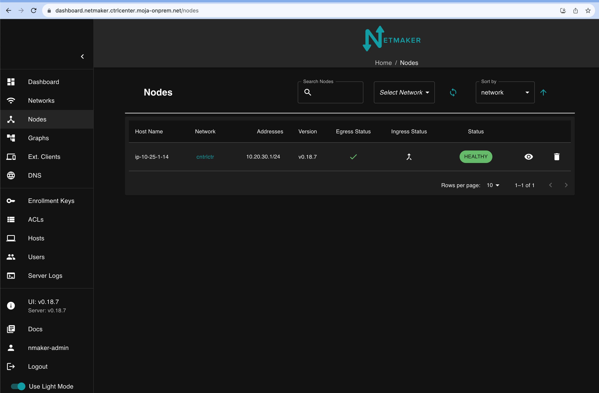

To create ingress gateway click on the ingress gateway empty icon and accept

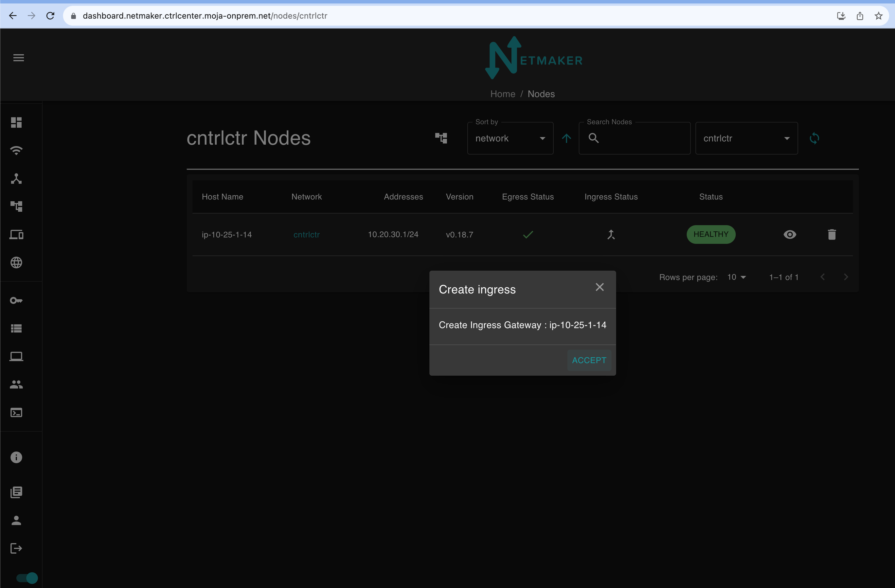

After creating the Ingress Gateway the node must looks like the following, both in green
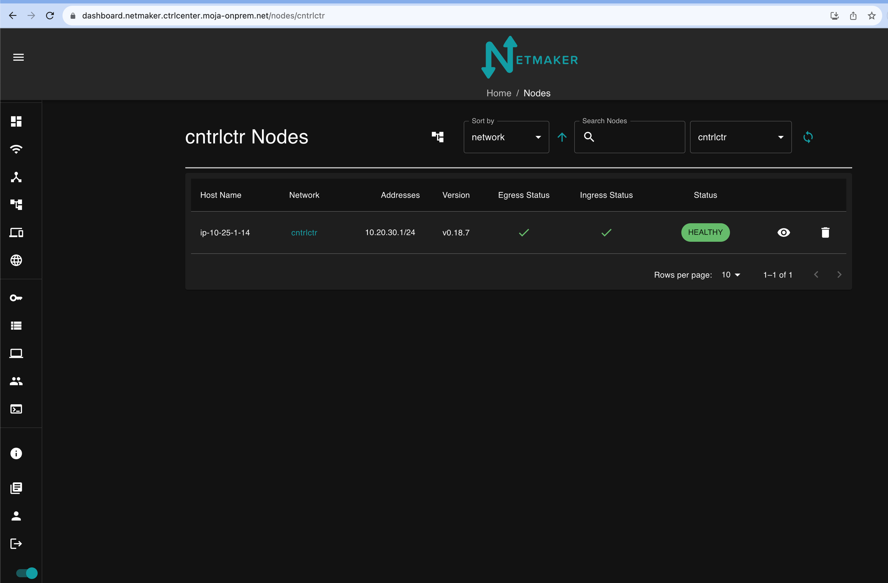
 

### Create external clients
Move to External Client Menu
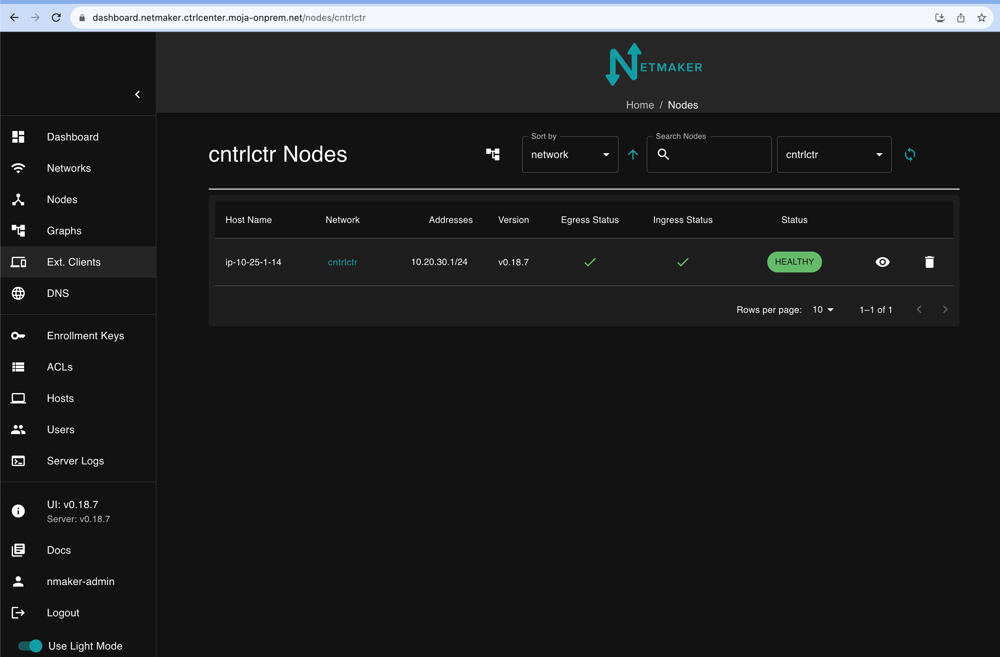

To add new external client clicking on Add External Client ( + icon )

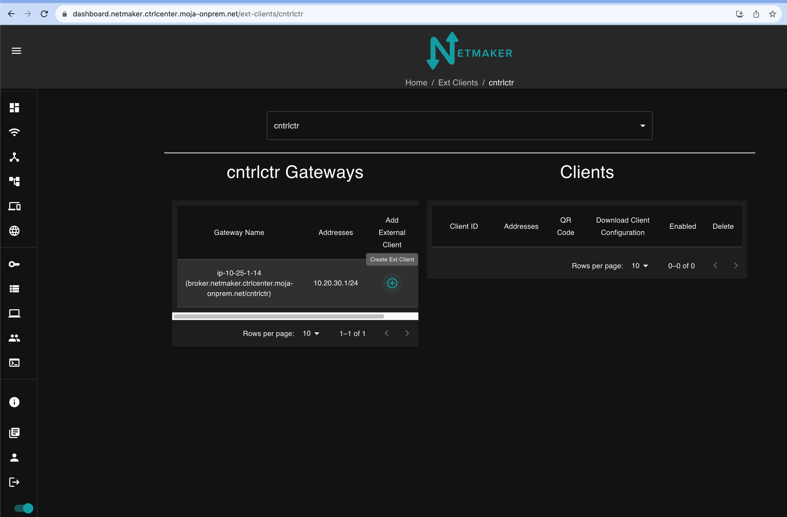

This will create automatically a new vpn profile to be assigned 

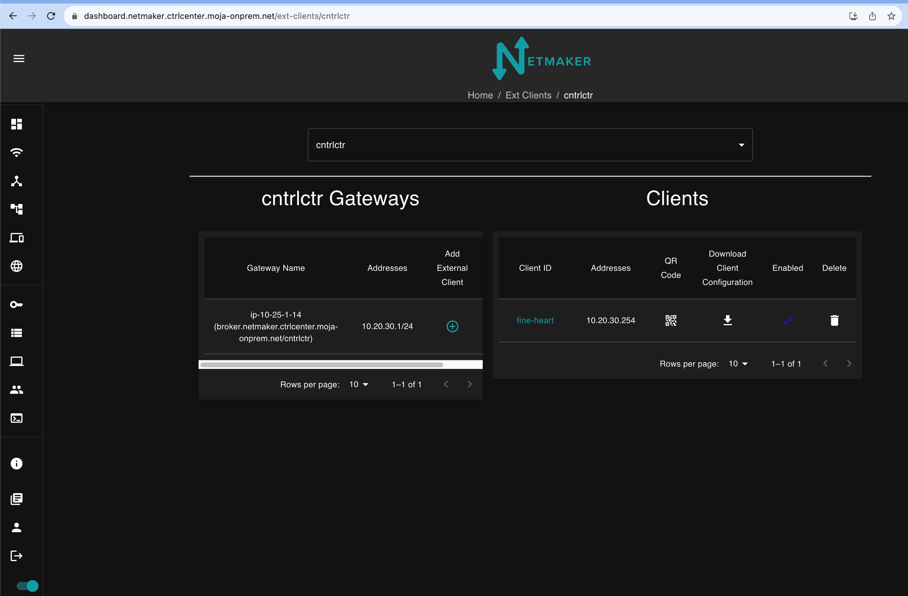

To rename the autogenerated Client ID click on profile name and modify the name as required

Download the wireguard vpn profile and share to the user in a secure way. 

## Login to vault 

Get the vault fqdn by running 

      yq eval '.docker.vars.vault_fqdn'  /iac-run-dir/output/control-center-post-config/inventory

Sing in to vault by usig OIDC , it will use the gitlab login identity and login to vault 

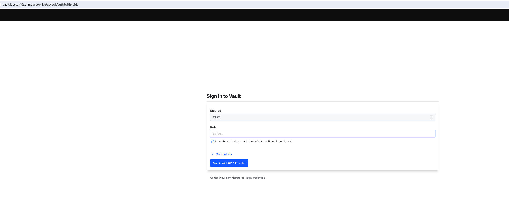

## Login to Gitlab 

Get the root password of gitlab by running 

      yq eval '.gitlab.vars.server_password'  $ANSIBLE_BASE_OUTPUT_DIR/control-center-deploy/inventory

From now on, make changes to the files inside gitlab and execute the jobs as necessary to make changes to the control center components

First pipeline will be waiting at Deploy job. Executing the deploy stage in the pipeline will run through the steps already run in the docker container, but will also run the control-center-post-config module which needs to run from within the internal network as it accesses the tenancy vault.

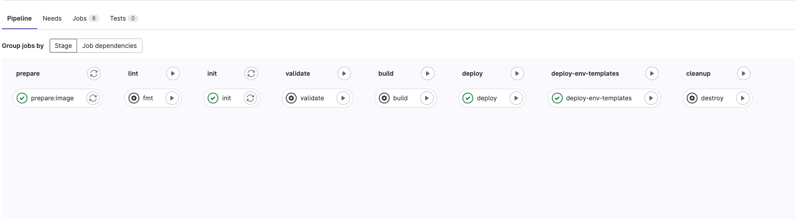

Deploy-env-templates stage will push the IAC code and relevant configurations to environment repositories created as per the configuration given in environment.yaml file. 

### control-center-post-config

        terraform {
        source = "git::https://github.com/mojaloop/iac-modules.git//terraform/config-params/control-center-post-config?ref=${get_env("IAC_TERRAFORM_MODULES_TAG")}"
        }

This module invocation is dependent on control_center_deploy, ansible_cc_post_deploy and control_center_pre_config and this one runs after them when the bootstrap cicd pipeline runs.

        inputs = {
        gitlab_admin_rbac_group       = local.env_vars.gitlab_admin_rbac_group
        gitlab_hostname               = dependency.control_center_deploy.outputs.gitlab_server_hostname
        vault_oauth_app_client_id     = dependency.control_center_pre_config.outputs.docker_hosts_var_maps["vault_oidc_client_id"]
        vault_oauth_app_client_secret = dependency.control_center_pre_config.outputs.docker_hosts_var_maps["vault_oidc_client_secret"]
        vault_fqdn                    = dependency.control_center_deploy.outputs.vault_fqdn
        env_map = merge(local.env_map,
            { for key in keys(local.env_map) : key => merge(local.env_map[key], {
            netmaker_ops_token = try(dependency.ansible_cc_post_deploy.outputs.netmaker_token_map["${dependency.ansible_cc_post_deploy.outputs.netmaker_control_network_name}-ops"].netmaker_token, "")
            netmaker_env_token = try(dependency.ansible_cc_post_deploy.outputs.netmaker_token_map["${key}-k8s"].netmaker_token, "")
            })
        })
        iac_group_id        = dependency.control_center_pre_config.outputs.iac_group_id
        gitlab_root_token   = dependency.control_center_deploy.outputs.gitlab_root_token
        vault_root_token    = dependency.ansible_cc_post_deploy.outputs.vault_root_token
        netmaker_master_key = dependency.control_center_deploy.outputs.netmaker_hosts_var_maps["netmaker_master_key"]
        netmaker_host_name  = dependency.control_center_deploy.outputs.bastion_hosts_var_maps["netmaker_api_host"]
        }

### config-params/control-center-post-config

#### GitLab secret integration 

* resource "vault_jwt_auth_backend" "gitlab_secrets" 
  * It creates a jwt auth backend in vault integrated with gitlab as the OIDC provider.
  * Vault's JWT and OIDC auth methods allow you to leverage JSON Web Tokens and the OpenID Connect protocol for user authentication, with GitLab serving as the JSON Web Key Set (JWKS) URL (and optional certificate chain) is configured. Pulic keys will be fetched from this endpoint during authentication. Pulic key will be used to verify the JWT token submitted by the client. 
* resource "vault_policy" "gitlab_ci_runner"
  * Creates a vault policy which allows to read and list secrets in kv secret engine at secret_path "secret"
* resource "vault_jwt_auth_backend_role" "gitlab_runner" 
  * This resource defines a role within the Vault JWT authentication backend.
  * It associates the role with the JWT authentication backend specified in vault_jwt_auth_backend.gitlab_secrets.path.
  * It associates the policy vault_policy.gitlab_ci_runner.name

#### Gitlab 

* GitLab Projects:
  * The code uses the gitlab_project resource to create projects in GitLab. It iterates over the var.env_map variable to create a project for each environment.

* GitLab Project Variables:
  * Multiple gitlab_project_variable resources are created to define variables for each GitLab project. These variables include information such as K8S_CLUSTER_TYPE, K8S_CLUSTER_MODULE, DOMAIN, CLOUD_PLATFORM, etc. The values come from the var.env_map variable.

* GitLab Group Variables:
  * gitlab_group_variable resources define variables at the group level. These include variables like VAULT_AUTH_PATH, VAULT_AUTH_ROLE, VAULT_SERVER_URL, etc. These variables are applied to all projects within the group.

* Group Access Token:
  * The gitlab_group_access_token resource creates a group access token with the name "gitlab ci pat" and an access level of "owner."

* Vault KV Secrets:
  * Several vault_kv_secret_v2 resources define secrets within Vault's Key-Value (KV) secret engine. 
  * Secrets include tokens, client IDs, and client secrets for various purposes, such as GitLab CI, Vault authentication, Grafana OAuth, etc.

* GitLab Application:
  * gitlab_application resources define OAuth applications in GitLab. These applications are created for Vault OIDC and Grafana OIDC, depending on the configurations specified in var.env_map.

* GitLab Project Variable for OAuth Enablement:
  * Additional gitlab_project_variable resources are created to enable or disable OAuth features for Vault and Grafana, depending on the configurations in var.env_map.

#### Vault transit resources

* Vault Key-Value (KV) Secrets Engine:
    * The vault_mount resource defines a KV version 2 secrets engine at the specified path (var.kv_path). It sets options for version 2 and a default lease time of 120 seconds.

* Vault Transit Secret Engine:
  * Another vault_mount resource defines the Transit secrets engine at the path "transit." This engine is designed for cryptographic operations.

* Vault Transit Key Generation:
  * The vault_transit_secret_backend_key resource generates a named key (unseal-key-${each.key}) in the Transit secrets engine for each environment specified in var.env_map. The key allows encryption and decryption operations.

* Vault Policy for Transit Secrets Engine:
  * The vault_policy resource defines a policy for each environment, allowing read and list capabilities on specific paths in the KV secrets engine and update capabilities for encrypting and decrypting using the Transit secrets engine.

* Vault Token:
  * The vault_token resource generates a Vault token for each environment, associating it with the policies defined in the corresponding vault_policy.

* Vault KV Secrets for Tokens:
  * The vault_kv_secret_v2 resource stores the generated Vault tokens in the KV secrets engine under the path ${each.key}/env_token.

* GitLab Project Variable for Transit Key Name:
  * The gitlab_project_variable resource defines a GitLab project variable named "TRANSIT_VAULT_UNSEAL_KEY_NAME" for each environment, storing the name of the Transit key generated for that environment.

#### OIDC integration 

        resource "vault_jwt_auth_backend" "gitlab_oidc" {
        description        = "terraform oidc auth backend"
        path               = "oidc"
        type               = "oidc"
        oidc_discovery_url = "https://${var.gitlab_hostname}"
        oidc_client_id     = var.vault_oauth_app_client_id
        oidc_client_secret = var.vault_oauth_app_client_secret
        bound_issuer       = "https://${var.gitlab_hostname}"
        default_role       = var.gitlab_admin_rbac_group
        }
 
        vault_oidc_client_id = var.enable_vault_oidc ? gitlab_application.tenant_vault_oidc[0].application_id : ""
        vault_oidc_client_secret  = var.enable_vault_oidc ? gitlab_application.tenant_vault_oidc[0].secret : ""

* Terraform resource block for configuring the OIDC (OpenID Connect) authentication backend in HashiCorp Vault.
* oidc_client_id and oidc_client_secret are originated from gitlab_application created in control-center-pre-config stage
* GitLab is configured as the oidc provider here
* It also creates Vault JWT auth backend role for a specific OIDC jwt auth backed and a corresponding policy for admin users assigned to this role, which allows the full access to vault resources.

## Prerequisites for running environment pipeline

1. Set aws_access_key_id CICD variable in environment repo 
 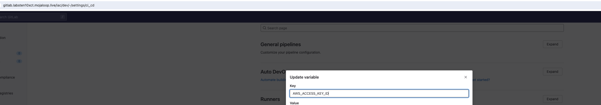
2. Set cloud_platform_client_secret in tenancy vault for the corresponding environment 
   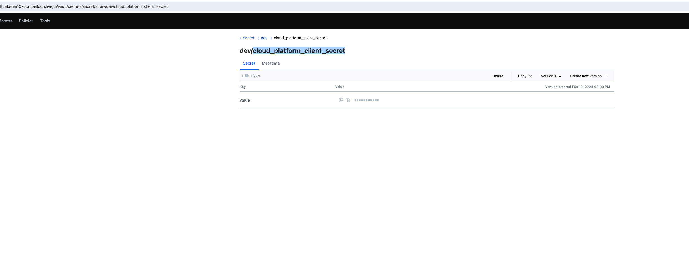

# Environment Repo on AWS Cloud Platform

The below part describes the various parts of the code flow that get executed during the creation of an environment especially, on the cloud platform AWS. It explains GitLab ci script which initiates the code execution, Terragrunt scripts for terraform configuration management, modular terraform modules for reusable infrastructure components, and ansible playbooks for streamlined automation used in the environment repositories.

# 1. Common GitLab script

The common GitLab script gets executed in all stages of the pipeline. The snippets included in this section set required tokens or env variables.

VAULT_SERVER_URL is set to tenancy vault hostname which is vault.labsten22.mojaloop.live for all vault commands executed in the script.

<!---->

    - export VAULT_TOKEN="$(vault write -field=token auth/${VAULT_AUTH_PATH}/login role=$VAULT_AUTH_ROLE jwt=$VAULT_ID_TOKEN)"

This command authenticates with the Vault server using a JWT ($VAULT\_ID\_TOKEN available in GitLab ci , as it is integrated to vault server) and the authentication path - auth/gitlab\_secrets\_jwt/login. The authentication is done with a specific role ($VAULT\_AUTH\_ROLE to which gitlab-ci-runner policy is attached), and the resulting token is then extracted and used for subsequent interactions with Vault.

For this VAULT\_SERVER\_URL is set to vault.labsten22.mojaloop.live

    - export ENV_VAULT_TOKEN="$(vault kv get -field=value ${KV_SECRET_PATH}/${CI_PROJECT_NAME}/env_token)"

This command retrieves the secret/dev/env\_token from vault and stores in ENV\_VAULT\_TOKEN which gets used in gitops-build ; this token gives the dev environment access to the control center vault, just to see the secrets/dev tree

    - export NETMAKER_OPS_TOKEN="$(vault kv get -field=value ${KV_SECRET_PATH}/${CI_PROJECT_NAME}/netmaker_ops_token)"
    - export NETMAKER_ENV_TOKEN="$(vault kv get -field=value ${KV_SECRET_PATH}/${CI_PROJECT_NAME}/netmaker_env_token)"

The above command retrieves secrets from secret/dev/netmaker_ops_token and netmaker_env_token , and sets NETMAKER_OPS_TOKEN & NETMAKER_ENV_TOKEN with the respective vaules.

    - export $CLOUD_PLATFORM_CLIENT_SECRET_NAME="$(vault kv get -field=value ${KV_SECRET_PATH}/${CI_PROJECT_NAME}/cloud_platform_client_secret)"

The above one gets the secret key for the cloud platform access , Example - AWS_ACCESS_SECRET_KEY

    - export GITLAB_CI_PAT="$(vault kv get -field=value ${KV_SECRET_PATH}/tenancy/gitlab_ci_pat)"

Gets the GitLab repo password 

     - export VAULT_GITLAB_ROOT_TOKEN="$(vault kv get -field=value ${KV_SECRET_PATH}/tenancy/vault_root_token)"

VAULT_GITLAB_ROOT_TOKEN is used as the authentication token to authenticate the vault terraform provider for creating vault resources using terraform. 

    - export METMAKER_MASTER_KEY="$(vault kv get -field=value ${KV_SECRET_PATH}/tenancy/netmaker_master_key)"

NETMAKER\_MASTER\_KEY - 

    - source setcivars.sh

Sets a set of env variables related GitLab , Terraform state management etc

    - yq eval '.' environment.yaml -o=json > environment.json
    - for var in $(jq -r 'to_entries[] | "\(.key)=\(.value)\n"' ./environment.json); do export $var; done

The above one loads all configurations in environment.yaml file as environment variables like below example 

    region=eu-west-1

    domain=mojaloop.live

    tenant=labsten22

    enable_github_oauth=false

    enable_netmaker_oidc=true

    ansible_collection_tag=v0.16.0

    envs=[{"env":"dev","domain":"labsk8s601.mojaloop.live","cloud_platform":"aws","cloud_platform_client_secret_name":"AWS_SECRET_ACCESS_KEY","k8s_cluster_module":"base-k8s","cloud_region":"eu-west-1","k8s_cluster_type":"microk8s","ansible_collection_tag":"v0.16.0","iac_terraform_modules_tag":"v0.28.27","enable_vault_oauth_to_gitlab":true,"enable_grafana_oauth_to_gitlab":true,"letsencrypt_email":"test@mojalabs.io","dns_zone_force_destroy":true,"longhorn_backup_object_store_destroy":true,"agent_instance_type":"m5.2xlarge","master_instance_type":"m5.4xlarge","master_node_count":3,"agent_node_count":0,"vpc_cidr":"10.106.0.0/23","enable_k6s_test_harness":false,"k6s_docker_server_instance_type":"m5.2xlarge"},]

# 2. Deploy infra stage in the GitLab pipeline 

This stage invokes the Terragrunt run-all apply and creates the whole environment. 

<!---->

       - !reference [.source, script]
       - Terragrunt run-all apply --terragrunt-non-interactive -input=false

After resolving the dependency , Terragrunt runs the terraform script in the below order. The below are the directories which contain Terragrunt configuration files which invoke IAC modules for creating the environment. 

1. k8s-deploy 

2. managed-services

3. k8s-store-config 

4. gitops-build

5. ansible-k8s-deploy 

6. ansible-managed-services-deploy 

The below sections describes the above ones.

## B.1 k8s-deploy terraform module

The source of the IAC module is given below

E.g iac-modules/terraform/aws/base-k8s

      iac-modules/terraform/aws/eks

    https://github.com/mojaloop/iac-modules.git//terraform/${get_env("CLOUD_PLATFORM")}/${get_env("K8S_CLUSTER_MODULE")}?ref=${get_env("IAC_TERRAFORM_MODULES_TAG")}"
    }

This module creates the base infra which contains the VPC, subnets, security groups , route53 resources etc. Also it creates the longhorn s3 bucket and aws user to access it. Along with this it creates the iam user which can update the route53 records for the use of exeternalDns k8s addon. 

### B.1.1 base-k8s

#### Invokes base_infra module to create the following resources

1. VPC, subnets, security groups of bastion instance for SSH access, wire guard UDP communication, bastion egress traffic, along with bastion instance. 

2) Netmaker VPC , netmaker subnets, security groups with rules and Netmaker instance 

3. Route53 resources - private zone, public zone, cluster_parent zone, nameserver records, a record for bastion ip with name “haproxy”

#### Invokes post-config-k8s module to create the following resources

1. IAM user with permissions to be able to update route53 records, for use with external-dns k8s addon

2. S3 buckets for longhorn backups , IAM user with permissions to access the bucket

3. Access key and secret key ids for the created user gets saved in secrets_var_map output variable

#### Invokes k6-test-harness module to create the following

1. Ec2 instance for running k6, its security group and a route53 dns record in public zone; [k6 is a developer-centric, open-source load testing tool designed for testing the performance of APIs, microservices, and websites]

#### Master and agent nodes for k8s

1. Creates the AWS launch template for master nodes

2. Creates the AWS launch template for agent nodes

3. Creates the AWS autoscaling group for the master nodes

4. Creates the AWS autoscaling group for the agent nodes

#### Load balancers

1. AWS load balancer (network LB) for internal traffic

2. Internal LB targets are kube api port, internal https port and internal http port

3. AWS load balancer (network LB) for external traffic

4. LB targets are https, http and wiregaurd ports

**_Note - Load balancer target groups are integrated to the ASGs, so that the LB target groups are automatically scaled up / down based on the resource usage. Also the LB targets are automatically added and removed from LB._** 

    resource "aws_autoscaling_group" "master" {
      name_prefix         = "${local.name}-master"
      desired_capacity    = var.master_node_count
      max_size            = var.master_node_count
      min_size            = var.master_node_count
      vpc_zone_identifier = module.base_infra.private_subnets

<!---->

      # Join the master to the internal load balancer for the kube api on 6443
      target_group_arns = local.master_target_groups

Security groups created with relevant rules and associated to master and agent nodes.

### B.1.2 eks

#### Invokes base_infra module to create the following resources

1. VPC, subnets, security groups of bastion instance for SSH access, wire guard UDP communication, bastion egress traffic, along with bastion instance. 

2. Netmaker VPC, netmaker subnets, security groups with rules and Netmaker instance 

3. Route53 resources - private zone, public zone, cluster_parent zone, nameserver records, a record for bastion ip with name “haproxy”

#### Invokes post-config-k8s module to create the following resources

1. IAM user with permissions to be able to update route53 records, for use with external-dns k8s addon

2. S3 buckets for longhorn backups , IAM user with permissions to access the bucket

3. Access key and secret key ids for the created user gets saved in secrets_var_map output variable

#### Invokes k6-test-harness module to create the following

1. Ec2 instance for running k6, its security group and a route53 dns record in public zone; [k6 is a developer-centric, open-source load testing tool designed for testing the performance of APIs, microservices, and websites]

#### Invokes EKS ("terraform-aws-modules/eks/aws") module for creating eks infrastructure

- Enables the VPC CNI (Container Network Interface) addon with specific configurations.

- Prefix delegation is enabled to increase the number of available ip address from VPC CNI

- Security Group Configuration: Adds an ingress rule allowing access to the EKS cluster from a bastion instance. The rule allows traffic on TCP port 443 (HTTPS) from the bastion instance's security group.

- Self-Managed Node Groups configuration : target_group_arns               = local.agent_target_groups  integrates with loadbalancer target groups

- Self-Managed Node Groups configuration : bootstrap_extra_args            = "--use-max-pods false --kubelet-extra-args '--max-pods=110'"

- Self-Managed Node Groups configuration : post_bootstrap_user_data        = <<-EOT

        yum install iscsi-initiator-utils -y && sudo systemctl enable iscsid && sudo systemctl start iscsid 

#### Load balancers

Similar to base_k8s 

**_Note - kube api server listener and target groups may not be required.Security groups created with relevant rules and associated to master and agent nodes. master node security groups not required, shall be removed in future_** 

## B.2 Managed-services

      
    source = "git::https://github.com/mojaloop/iac-modules.git//terraform/${get_env("MANAGED_SVC_CLOUD_PLATFORM")}/support-svcs/deploy-managed-svcs?ref=${get_env("IAC_TERRAFORM_MODULES_TAG")}"

Example source :  iac-modules/terraform/aws/support-svcs/deploy-managed-svcs

1. ### Deploy RDS

Invokes deploy_rds module, for the managed services where external_service is false and database type is “mysql” in mojaloop-stateful-resources.json file 

     external_services = { for managed_service in local.managed_services : managed_service.resource_name => managed_service if managed_service.external_service}
      rds_services = { for managed_service in local.managed_services : managed_service.resource_name => managed_service if managed_service.external_service && managed_service.resource_type == "mysql"}

2. ### Base_infra for managed services

Also there is call to base_infra - k8s cluster and managed services are decided to be running on different vpcs, or even managed services on different cloud computing platforms like mysql on azure , kafka on confluent etc

    **_Note - The idea is that managed services can be hosted on aws but k8s cluster can be on-premise, so even in Terragrunt the managed services module invocation is not dependent on any others._**

## B.3 K8s-store-config

K8s-store-config runs after k8s-deploy and managed-services_

    source = "git::https://github.com/mojaloop/iac-modules.git//terraform/config-params/k8s-store-config?ref=${get_env("IAC_TERRAFORM_MODULES_TAG")}"

Example : iac-modules/terraform/config-params/k8s-store-config

It invokes terraform script to create GitLab project variables in the environment project repo. Also it creates a set of vault generic secrets. 

### B.3.1 Create a set of GitLab project variables

create a set of **gitlab project variables** based on properties_var_map

    properties_var_map = merge(dependency.k8s_deploy.outputs.properties_var_map, dependency.managed_services.outputs.properties_var_map)

The above properties var map is originally from post-config-k8s module’s output variable post_config_properties_key_map, which consists of longhorn backup bucket name
longhorn_backups_bucket_name_key = "longhorn\backups_bucket_name" etc

And also managed services properties var map which consists of db instance addresses

    output "properties_var_map" {
      value = {
        for index, rds_module in module.rds : 
          var.rds_services[index].external_resource_config.instance_address_key_name => rds_module.db_instance_address
      }
    }

Look at the example project variable of environment-specific repo, created based on the properties_var_map of post-config-k8s 

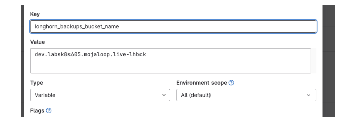

### B.3.2 Create vault generic secrets

<!---->

    resource "vault_generic_secret" "secrets_var_map" {
      for_each            = var.secrets_key_map
      path                = "${var.kv_path}/${var.cluster_name}/${each.value}"
      delete_all_versions = true
      data_json = jsonencode(
        {
          value = var.secrets_var_map[each.value]
        }
      )
    }

Creates as  many secrets in vault’s kv2 engine , as the number of elements in the secrets_key_map ( it uses the values from secrets_var_map ) variable 

value of secrets_var_map originates from

     secrets_key_map    = merge(dependency.k8s_deploy.outputs.secrets_key_map, dependency.managed_services.outputs.secrets_key_map) 

Which in turn,  originates from

    output "secrets_var_map" {
      sensitive = true
      value = {
        route53_external_dns_access_key = aws_iam_access_key.route53-external-dns.id
        route53_external_dns_secret_key = aws_iam_access_key.route53-external-dns.secret
        longhorn_backups_access_key     = aws_iam_access_key.longhorn_backups.id
        longhorn_backups_secret_key     = aws_iam_access_key.longhorn_backups.secret
      }
    }

<!---->

    output "post_config_secrets_key_map" {
      value = {
        external_dns_cred_id_key         = "route53_external_dns_access_key"
        external_dns_cred_secret_key     = "route53_external_dns_secret_key"
        longhorn_backups_cred_id_key     = "longhorn_backups_access_key"
        longhorn_backups_cred_secret_key = "longhorn_backups_secret_key"
      }
    }

We can see the vault kv2 secret engine at the path ${var.kv_path}/${var.cluster_name}/** where kv_path is obtained from CICD project variable KV_SECRET_PATH=”secret” and cluster_name=dev , so the above vault secrets get created at path **“secret/dev”.** 

See below long_horn and external dns secret key and access key created in Vault

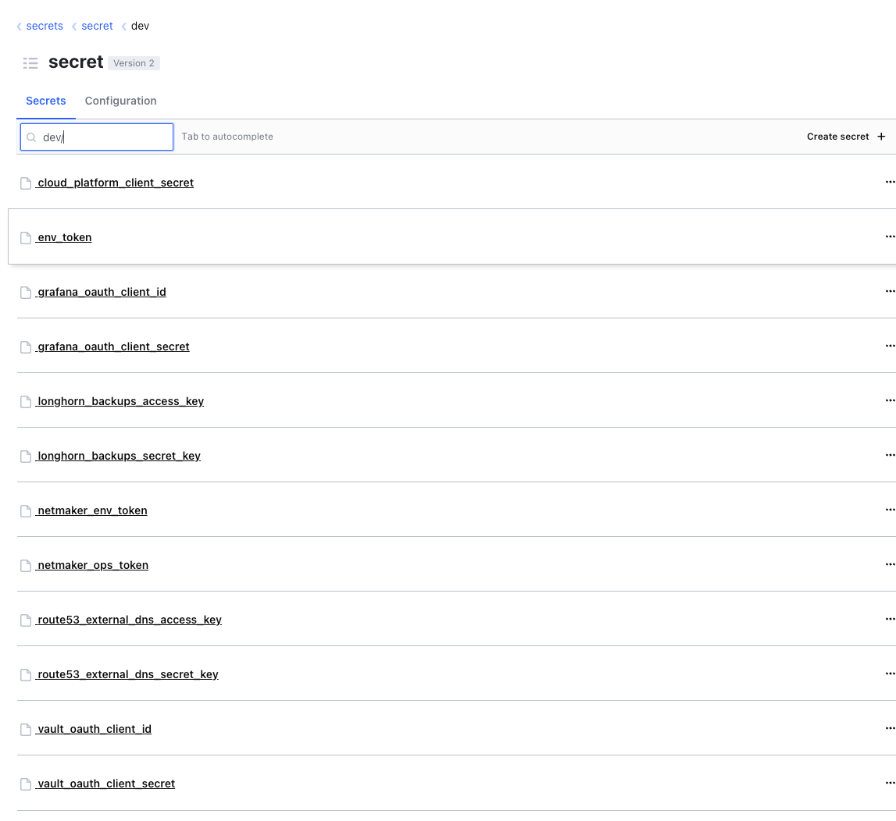

**_Note - Provider configuration for vault provider points the server address to tenancy vault server vault.labsten22.mojaloop.live, so that the above secrets are created in the tenancy vault ,not in the environment specific vault._**

    provider "vault" {
      address = "${local.VAULT_SERVER_URL}"
      token   = "${local.VAULT_GITLAB_ROOT_TOKEN}"
    }

    VAULT_SERVER_URL          = get_env("VAULT_SERVER_URL")

Look at the value of source variable, which is tenancy vault server

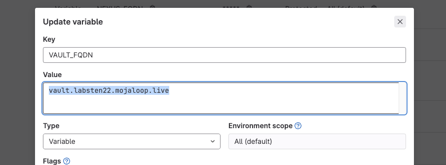

## B.4 anisble-k8s-deploy

    source = "git::https://github.com/mojaloop/iac-modules.git//terraform/ansible/k8s-deploy?ref=${get_env("IAC_TERRAFORM_MODULES_TAG")}"

Source is iac-modules/terraform/ansible/k8s-deploy

This is dependent on k8s-deploy and k8s-store-config

### B.4.1 Generation of ansible inventory file

Creates a local sensitive file using local_sensitive_file terraform resource to prepare the ansible inventory file. The call passes all required parameters for the template file which actually generates the inventory. 

The inventory template file contains the loop snippet like below

        %{~ for host in all_hosts ~}
        ${host}:
        %{~ endfor ~}

This one generates the host names in the inventory. Example of generated inventory:

     master: 
      hosts: 
        i-0a5631edeb475fa06:
          ansible_host: 10.106.0.6
        i-0e165ed8f472b9d0f:
          ansible_host: 10.106.0.11
        i-0fbeeb46526e844b8:
          ansible_host: 10.106.0.24

The below loop generates the ansible variables for a host group

         %{~ for varmapkey, varmapval in bastion_hosts_var_maps ~}
         ${varmapkey}: '${varmapval}'
         %{~ endfor ~}

Example of generated yaml snippet

    bastion: 
      hosts: 
        bastion:
          ansible_host: 3.250.233.155
      vars:
        ansible_ssh_common_args: '-o StrictHostKeyChecking=no'
        argocd_lovely_plugin_version: '0.18.0'
        argocd_version: '2.8.2'
        cluster_name: 'dev'

The below loop snippet creates ansible vars that need to be generated in yaml format 

        %{~ for varmapkey, varmapval in master_hosts_yaml_maps ~}
        ${varmapkey}:
          ${indent(6, varmapval)}
        %{~ endfor ~}

Example of generated variable in yaml format

     vars:
        ansible_ssh_common_args: '-o StrictHostKeyChecking=no'
        netmaker_networks:
          - "network_name": "cntrlctr"
            "node_keys":
            - "ops"
          - "network_name": "dev"
            "node_keys":
            - "k8s"

### B.4.1 Execution of ansible-playbook

Terraform invokes a local exec provisioner to call ansible galaxy install collection and ansible-playbook execution. This part invokes the playbook using the below variable

ansible_playbook_name       = argo${local.K8S_CLUSTER_TYPE}_cluster_deploy

K8S_CLUSTER_TYPE can be microk8s, k3s or eks. Based on the value of the variable any of the following playbook can get exected

#### B.4.1.1 argomicrok8s_cluster_deploy ansible playbook

In summary, this is to install the iac stacks like netclient, haproxy etc on bastion node ; microk8s master and worker on k8s nodes.

##### Bastion common, netclient and haproxy roles installed on bastion node

##### Bastion common role: 

Uploads SSH key to root home

Updates apt cache 

Install python and its dependencies

##### Netclient role:

Installs netclient gpg key and package repo 

Installs wiregaurd and netclient

Joins the netmaker network using the netmaker_join_tokens

<!---->
       - name: set token from local file
         vars:
           query: "[?tags[0]=='{{ item }}'].token"
         set_fact:
           netmaker_join_tokens: "{{ netmaker_join_tokens + [lookup('file', netmaker_enrollment_key_list_file_location) | from_json | json_query(query) | first] }}"
         when: "not netmaker_join_tokens"
         loop: "{{ netclient_enrollment_keys }}"

the above snippet is from netclient role in argomicrok8s playbook

The above one gets the netmaker join tokens from netmaker\_join\_tokens variable ( originally from

    export NETMAKER_OPS_TOKEN="$(vault kv get -field=value ${KV_SECRET_PATH}/${CI_PROJECT_NAME}/netmaker_ops_token)"

Netclient_entrollment_keys value is ["cntrlctr-ops"] and it just uses the netmaker join tokens set above to join the netmaker network for the corresponding env

Another ansible task ensures that the default policy for the FORWARD chain in iptables is set to ACCEPT. This is often used in scenarios where the system is functioning as a router or gateway, and you want to allow the forwarding of packets between different network interfaces. 

Enable auto restart of netclient service\
**_Note - In the netmaker role invoked in control center post deploy stage , based on the environments in environment.yaml it pre-creates the network and enrollment keys. And in the control center post config, it adds those netmaker_ops_token and netmaker_env_tokens into the env_map variable. Then it uses env_map vault kv2 secrets for the netmaker ops token and env tokens in env specific paths in tenancy vault. When the netclient role runs for the k8s bastion host, it gets the key and joins the network._**

##### haproxy role:

Installs and configures haproxy

Haproxy routing configuration is also given. It routes the traffic to vault, minio, and nexus.

##### Microk8s role on master node

MicroK8s is a lightweight, easy-to-install Kubernetes distribution developed by Canonical, the company behind Ubuntu. It is designed to provide a simplified and efficient way to run Kubernetes clusters on various platforms, including desktops, edge devices, and on-premises servers. MicroK8s is distributed as a snap package, which simplifies the installation and updates. Snaps are containerized software packages that include dependencies, reducing compatibility issues

##### Install.yaml

Installs Snapd (Snap is a software packaging and deployment system developed by Canonical for operating systems that use the Linux kernel and the systemd init system).

Installs microk8s package using snap package manager

Creates helm and kubectl aliases

Also, this playbook is designed to handle custom certificates in a MicroK8s environment. It involves generating certificate configuration from a template, refreshing certificates, creating a directory for storing certificates, copying certificates to that directory, and updating the system's trust store. microk8s refresh-certs command is used in MicroK8s (Micro Kubernetes) to refresh or renew the TLS certificates used in the cluster. TLS certificates are essential for securing communication within a Kubernetes cluster, especially for components like the Kubernetes API server.

##### Configure-groups.yaml

Also this ansible playbook sets up Kubernetes and Helm for multiple users. It adds users to the microk8s group, creates kubectl configurations and directories for each user, and adds Helm repositories for users if Helm 3 is enabled (microk8s\_plugins.helm3).

##### Configure-HA.yaml

This Ansible playbook contains a task to enumerate and update the `/etc/hosts` file on each host in a MicroK8s HA (High Availability) cluster. The goal is to ensure that the hosts in the HA cluster are listed in the `/etc/hosts` file, associating each host's IP address with its hostname. There is another similar task to ensure all the workers ip and host names are present in the etc/hosts file. 

    - block:
       - name: Waiting for microk8s to be ready on microk8s host master
         command: "microk8s status --wait-ready"
         delegate_to: "{{ designated_host }}"
         delegate_facts: true
         changed_when: false

<!---->

       - name: Get the microk8s join command from the microk8s master
         shell: "microk8s add-node | grep -E -m1 'microk8s join {{ microk8s_ip_regex_HA }}'"
         delegate_to: "{{ designated_host }}"
         delegate_facts: true
         changed_when: false
         register: microk8s_join_command

<!---->

       - name: Get microk8s cluster nodes
         command: "microk8s kubectl get node"
         delegate_to: "{{ designated_host }}"
         delegate_facts: true
         changed_when: false
         register: microk8s_cluster_node

<!---->

       - name: Waiting for microk8s to be ready on microk8s host node
         command: "microk8s status --wait-ready"
         changed_when: false

<!---->

       - name: Fetch kubeconfig
         fetch:
           src: "/root/.kube/config"
           dest: "{{ kubeconfig_local_location }}/kubeconfig"
           flat: yes
         delegate_to: "{{ designated_host }}"
         delegate_facts: true

<!---->

       - name: Set the microk8s join command on the microk8s node
         command: "{{ microk8s_join_command.stdout }}"
         when: microk8s_cluster_node.stdout.find(inventory_hostname) == -1
         register: join_command_output
         failed_when:
           - "'already known to dqlite' not in join_command_output.stdout"
           - join_command_output.rc > 0

<!---->

     become: true
     when:
       - inventory_hostname != designated_host
       - inventory_hostname in groups[microk8s_group_HA]

The above blocks run when the inventory host is one among the master and is not the designated ( first from the sorted list )\
It greps the join commands from the master node and gets it to a variable 

Post waiting for the master to be ready it fires the join command, if it is not already part of the cluster. This is for forming the cluster of masters. 

##### Microk8s role on worker node

##### Configure-worker.yaml

    - name: Find the designated host
     set_fact:
       designated_host: "{{ (groups[microk8s_group_HA]|sort)[0] }}"

<!---->

    - block:
       - name: Waiting for microk8s to be ready on microk8s host master
         command: "microk8s status --wait-ready"
         delegate_to: "{{ designated_host }}"
         delegate_facts: true
         changed_when: false

<!---->

       - name: Get the microk8s join command from the microk8s master
         shell: "microk8s add-node | grep -E -m1 'microk8s join {{ microk8s_ip_regex_HA }}'"
         delegate_to: "{{ designated_host }}"
         delegate_facts: true
         changed_when: false
         register: microk8s_join_command

<!---->

       - name: Get microk8s cluster nodes
         command: "microk8s kubectl get node"
         delegate_to: "{{ designated_host }}"
         delegate_facts: true
         changed_when: false
         register: microk8s_cluster_node

<!---->

       - name: Waiting for microk8s to be ready on microk8s worker node
         command: "microk8s status --wait-ready"
         changed_when: false
         register: status_command_output
         failed_when:
           - "'This MicroK8s deployment is acting as a node in a cluster.' not in status_command_output.stdout_lines"
           - status_command_output.rc > 0

<!---->

       - name: Set the microk8s join command on the microk8s node
         command: "{{ microk8s_join_command.stdout }} --worker"
         when: microk8s_cluster_node.stdout.find(inventory_hostname) == -1
         register: join_command_output
         failed_when:
           - "'already known to dqlite' not in join_command_output.stdout"
           - join_command_output.rc > 0

<!---->

     become: true
     when:
       - inventory_hostname != designated_host
       - inventory_hostname in groups[microk8s_group_WORKERS]

The above blocks run when the inventory host is one among the worker nodes and is not the designated ( first from the sorted list )\
It greps the join commands from the master node (output of add node command ) and stores it to a variable 

Post waiting for the master to be ready it fires the join command, if it is not already part of the cluster. This is for joining each of the worker nodes to the cluster.

##### Addons.yaml

This is invoked only if `microk8s_enable_HA is false`

##### Helm and argocd role on bastion node

Installs helm

Installs kubectl, kustomize
Installs external secret helm chart in kubernetes 
Installs argocd using kustomize.
It changes the argocd-repo-server deployment manifest by adding argocd-lovely-plugin
It creates the clusterSecretStore ( tenant-vault-secret-store and gitlab-secret-store) for GitLab and vault , as a central gateway from k8s to vault and GitLab secret backend. 
It has templates for argocd-cm configmap containing the lua scripts for checking the health of argocd applications and certmanager certificates, and kustomize overrides the argocd-cm configmap default manifest using it.
It creates the k8s secret having the repository username and password for argocd controlplane to access GitLab projects. 
It creates the root argocd application which acts as the root of all other argocd applications.
Installs netclient daemon in kubernetes , so that is part of netmaker network. netmaker_env_token is read via the externalSecretstore by creating an externalSecret.
Installs k6 on testharness box

#### B.4.1.2 argok3s_cluster_deploy ansible playbook

#### B.4.1.1 argoeks_cluster_deploy ansible playbook

## B.5 gitops-build

    source = "git::https://github.com/mojaloop/iac-modules.git//terraform/gitops/k8s-cluster-config?ref=${get_env("IAC_TERRAFORM_MODULES_TAG")}"

source = iac-modules/terraform/gitops/k8s-cluster-config

Gitops-build is dependent on k8s-deploy and k8s-store-config => meaning it should only run after creating k8s infrastructure [along with external secret controlplane , argocd etc running on it] and relevant cicd vars in GitLab & kv2 secrets in the tenancy vault.

### B.5.1 k8s-cluster-config

All modules in this secrion invokes the source module generate-files

      file_list       = ["values-mcm.yaml", "kustomization.yaml", "vault-rbac.yaml", "vault-secret.yaml", "vault-agent.yaml", "keycloak-realm-cr.yaml", "configmaps/vault-config-configmap.hcl", "configmaps/vault-config-init-configmap.hcl", "istio-gateway.yaml", "vault-certificate.yaml"]

Generate-files module has the following snippet 

    resource "local_file" "config-file" {
      for_each = toset(var.file_list)
      content  = templatefile("${var.template_path}/${each.value}.tpl", var.var_map)
      filename = "${var.output_path}/${each.value}"
    }

<!---->

    resource "local_file" "app-file" {
      content  = templatefile("${var.template_path}/app/${var.app_file}.tpl", var.var_map)
      filename = "${var.app_output_path}/${var.app_file}"
    }

The first one generates a set of files based on the file list variable value, For example the above file\_list var has a list of values like values-mcm.yaml, values-rbac.yaml etc. There will be as many tpl files as the number of files in the file\_list variable, present in the corresponding directory in templates path in generate-files module. So the first snippet generates the files based on these templates for all the files in the file\_list. 

The second one generates the argocd application manifest for the corresponding application. 

The files that contain argocd application yamls gets stored in apps/app-yamls directory and the files generated in the first section goes to specific directories like app/mojaloop , app/mcm , app/istio etc in the environment repo.

#### B.5.1.1 apps-deploy

It consists of two module invocations 
    1. Mojaloop
    2. Pm4ml

1. #### Mojaloop

The invocation is conditional based on var.common_var_map.mojaloop_enabled

    file_list       = ["chart/Chart.yaml", "chart/values.yaml", "custom-resources/ext-ingress.yaml", "custom-resources/istio-gateway.yaml", "custom-resources/grafana.yaml"]
    template_path   = "${path.module}/../generate-files/templates/mojaloop" 

As the file_list has the above values, it uses the below templates in the iac-modules repo 

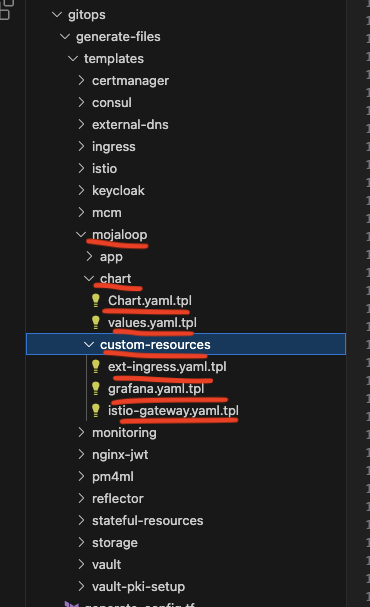

Mojaloop directory contains following module invocations. 
* Generate_mcm_files 
    * Istio virtual service to route requests mcm UI and mcm api
    * Request authentication and Authorization policy resource to define the request authentication methods of mcm api calls which denies requests to api without request principals obtained from dfsp keycloak realm , when connection hostnames are `mcm.dev.labsk8s601.mojaloop.live`
    * Keycloak realm import resource which creates the dfsps realm with all clients
    * Certmanager certificate vault-tls-certificate from the issuer created above ( vault-cluster-issuer) and generates the certificate and stores in secret vault-tls-cert, which gets used in several places like mojaloop istio gateway and mcm values file
    * Vault rbac - Service account,secret for service account token , clutter role which binds mcm service account with aut-delegator role
    * KubernetesAuthEngineRole in vault kubernetes authentication end point integrating to mcm policy for mcm service account in mcm namespace
    * Vault policy ( mcm-policy) which allows full access to secret/whitelist\* , pki-root-ca , secret/mcm/\* etc

* Generate_mojaloop_files 
    * Deploys mojaloop helm chart
    * Additional custom resource 
        * Istio gateway interop-gateway which defines how external traffic with the specified hostname 'extapi.dev.labsk8s601.mojaloop.live' should be handled by Istio, including TLS settings for secure communication. Tls configuration points to the vault-tls-cert certificate and it expects communication in mutual TLS
        * AuthorizationPolicy interop-jwt which enforces access control rules for the Istio Ingress Gateway "istio-external-ingress-gw". It is configured to deny access for requests that do not coming from sources outside the specified Keycloak realm URL pattern and with specific SNI values extapi.dev.labsk8s601.mojaloop.live. The intention is to control access based on the source identity and SNI values in the incoming requests.
        * VirtualService interop-vs which is configured to route incoming requests based on their URI prefixes to different backend services, enabling traffic management for various functionalities within the specified host 'extapi.dev.labsk8s601.mojaloop.live'
        * A set of other virtual services that defines the route for different URI prefixes for the traffic entering via gateway istio-ingress-int/internal-wildcard-gateway

* Generate_vault_pki_setup_files
    * Secret engine mount ‘pki-root-ca’ - which creates PKI secret engine in vault
    * PKI Secret Engine config - This will generate a new self signed CA certificate and private key
    * PKI Secret Engine Role - which creates a role called server-cert-role in PKI Secret Engine which will issue certificates using the pki-root-ca level. 
    * Policy - which creates a policy called pki-root-full which has full access to PKI engine endpoint pki-root-ca
    * Kubernetes Auth Engine Role named cert-man-cluster-issuer-role which creates a role in kubernetes authentication endpoint with the above-created policy associated with it. So that the targetServiceAccount principal from the mentioned namespace has full access to pki-root-full. 
    * A cluster issuer certman resource (vault-cluster-issuer named) which integrates with vault, configured to assume the above role to create the CA ( which is configured in pki-root-ca) .These are resources that represent certificate authorities (CAs) able to sign certificates in response to certificate signing requests.

* Mojaloop Stateful resources

    * Installs mysql , mongodb and redis for different purposes
    * Contains vaules file for customizing each installation
    * PasswordPolicy, RandomSecret and VaultSecret resources for creating the password, and fetching it to k8s as db passwords

2. #### Pm4ml

### B.5.1.2 certmanager-config

<!---->
     file_list       = ["charts/certmanager/Chart.yaml", "charts/certmanager/values.yaml", "certmanager-clusterissuer.yaml",  "clusterissuers/lets-cluster-issuer.yaml", "certman-extsecret.yaml", "certmanager-helm.yaml"] 
     template_path   = "${path.module}/../generate-files/templates/certmanager"

  * Argocd application manifests for certman helm chart deployment , and below externalSecret & ClusterIssuer 
  * Generates ExternalSecret route53-cert-man-credentials - This ExternalSecret configuration is to sync AWS credentials for Route 53 (AWS Secret Access Key and AWS Access Key ID) from the external secret store  Vault secret store to a Kubernetes Secret named "route53-cert-man-credentials"
  * Generates letsencrypt ClusterIssuer - This ClusterIssuer configuration is to use Let's Encrypt's ACME server to automatically obtain TLS certificates for the environment DNS zone ("dev.labsk8s601.mojaloop.live") using the DNS01 challenge with Route 53 as the DNS solver for AWS. 
    The AWS credentials required for Route 53 are stored in the Kubernetes Secret named "route53-cert-man-credentials" created from the above ExternalSecret

### B.5.1.3 consul-config

    file_list       = ["Chart.yaml", "values.yaml"]
    template_path   = "${path.module}/../generate-files/templates/consul"

  * Generates the files for consul helm chart deployment

### B.5.1.4 external-dns-config

     file_list       = ["chart/Chart.yaml", "chart/values.yaml", "external-secrets/extdns-extsecret.yaml"]
     template_path   = "${path.module}/../generate-files/templates/external-dns"

   * Generates ExternalSecret route53-external-dns-credentials - This ExternalSecret is to manage AWS credentials for Route 53, syncing them from the external secret store vault to a Kubernetes Secret named "route53-external-dns-credentials." 
   * Chart and values files for deploying externalSecret helm chart. 

### B.5.1.5 ingress
Redundant as istio ingress gateways are in use.

### B.5.1.6 istio

     file_list = ["istio-deploy.yaml",
     "istio-gateways.yaml", "istio-main/kustomization.yaml", "istio-main/namespace.yaml",
     "istio-main/values-kiali.yaml", "istio-main/values-istio-base.yaml", "istio-main/values-istio-istiod.yaml",
     "istio-gateways/kustomization.yaml", "istio-gateways/values-istio-external-ingress-gateway.yaml",
     "istio-gateways/values-istio-internal-ingress-gateway.yaml", "istio-gateways/lets-wildcard-cert.yaml",
     "istio-gateways/namespace.yaml", "istio-gateways/proxy-protocol.yaml", "istio-gateways/gateways.yaml",
     "istio-gateways/values-istio-egress-gateway.yaml"]

     template_path   = "${path.module}/../generate-files/templates/istio"

* Istio main app - installs istiod , istio CRs and kiali
* Istio gateways app
   * Internal ingress gateway
   * External ingress gateway
   * Egress gateway
   * Envoy filter Proxy protocol - since we whitelist ip addresses that are allowed to talk to the external gateway, we need to pass the original source ip. So this envoy filter is for the external ingress gateway pod to get the original source ip and port from where the traffic generated
   * Certificate lets encrypt wildcard which replicates it from istio-system to other namespaces like keycloak, istio-ingress-ext , istio-ingress-int using reflector 
   * Gateway namepsaces ingress-ext, ingress-int and egress
   * Values file for customizing ingress gateway deployments
     

### B.5.1.7 keycloak

        file_list = ["install/kustomization.yaml", "post-config/kustomization.yaml", "post-config/keycloak-cr.yaml",
        "post-config/vault-secret.yaml", "post-config/keycloak-ingress.yaml", "keycloak-install.yaml", "keycloak-post-config.yaml"]
        template_path   = "${path.module}/../generate-files/templates/keycloak"

* It installs the control plane of keycloak using keycloak operator, so it creates the CRD and operatory deployment and other required resources
* It creates the keycloak CR , which in turn creates a stateful set , service and other related resources for running a keycloak instance, it connects to the `keycloak-db.stateful-resources.svc.cluster.local` database.
* Also it creates the virtual service and destination rule to route the traffic to switch-keycloak-service which is representing the keycloak sts created by keycloak CR.
* Vault secret - Passwordpolicy 

### B.5.1.8 Monitoring

        file_list = ["monitoring-install.yaml", "monitoring-post-config.yaml", "install/kustomization.yaml",
              "install/values-prom-operator.yaml", "install/values-grafana-operator.yaml", "install/values-loki.yaml", 
              "install/values-tempo.yaml", "install/vault-secret.yaml", "install/istio-gateway.yaml", 
              "post-config/monitoring-crs.yaml", "post-config/longhorn-crs.yaml", "post-config/istio-crs.yaml", ]
        template_path   = "${path.module}/../generate-files/templates/monitoring"

* It creates the grafana operator crds, grafana operator 
* A random secret, password policy and vault secret to create the grafana admin password
* Installs promethues-operator crds, kube-promethues helm chart which 
* Installs grafana loki and tempo 
* Post config monitoring - [in progress]
    * PodMonitor ( istio )
    * GrafanaDashboard
    * ServiceMonitor ( long horn)

### B.5.1.9 Vault

* Vault external secrets which fetch secrets from tenancy vault; it uses clusterSecretStore created during the ansible-k8s-deploy stage while running argocd ansible playbook. It fetches the below ones for the corresponding environment. 
    * Vault-seal-token-secret 
    * Vault-oidc-client-id-secret
    * Vault-oidc-client-secret-secret
    * Vault-gitlab-credentials-secret

* Post-config configmap for the vault
   * It contains the bootstrap script to initialize the vault
   * It initializes and gets the root tokens and seal keys 
   * It logins to the vault and creates a few policies including admin policy 
   * It enables kubernetes auth engine
   * Configures kubernetes auth engine by allowing all namespaces and service accounts to have access to all vault secrets
   * It enables kv engine
   * It enables oidc auth engine
   * It configures oidc auth engine by integrating it to GitLab oidc provider
   * It creates couple of roles techops-admin and techops-readonly

* Istio virtual service for routing requests to dev environment vault via istio ingress internal gateway
* Vault for environment - Vault control plane installation 
* Vault config operator - Vault config operator control plane installation points to http://vault.vault.svc.cluster.local:8200 which is vault installed in kubernetes in the corresponding environment.
  So all CRs [SecretEngineMount, RadomSecret, VaultSecret etc ]related to vault config operator are getting created in env vault. 
      - name: VAULT_ADDR
        value: http://vault.vault.svc.cluster.local:8200    
* Vault PKI Setup 

### B.5.1.9 MCM

* Istio virtual service to route requests mcm UI and mcm api
* Request authentication and Authorization policy resource to define the request authentication methods of mcm api calls which denies requests to api without request principals obtained from dfsp keycloak realm , when connection hostnames are `mcm.dev.labsk8s601.mojaloop.live`
* Keycloak realm import resource which creates the dfsps realm with all clients
* Certmanager certificate vault-tls-certificate from the issuer created above ( vault-cluster-issuer) and generates the certificate and stores in secret vault-tls-cert, which gets used in several places like mojaloop istio gateway and mcm values file
* Vault rbac - Service account ,secret for service account token, clutter role which binds mcm service account with aut-delegator role
   * KubernetesAuthEngineRole in vault kubernetes authentication end point integrating to mcm policy for mcm service account in mcm namespace
   * Vault policy ( mcm-policy) which allows full access to secret/whitelist\* , pki-root-ca , secret/mcm/\* etc

### B.5.1.9 storage

       file_list       = ["chart/Chart.yaml", "chart/values.yaml", "external-secrets/longhorn-extsecret.yaml", "custom-resources/longhorn-job.yaml"]
       template_path   = "${path.module}/../generate-files/templates/storage"

* Longhorn helm chart installation
* Long horn values file for the helm chart
* RecurringJob long horn CR for backing up the data
* ExternalSecret CR to fetch longhorn AWS ACCESS KEY ID and SECRET KEY from vault secret from tenancy vault server

## B.6 anisble-managed-services-deploy

       terraform {
        source = "git::https://github.com/mojaloop/iac-modules.git//terraform/ansible/managed-services-deploy?ref=${get_env("IAC_TERRAFORM_MODULES_TAG")}"
       }

    Source is terraform/ansible/managed-services-deploy

### B.6.1 ansible/managed-services-deploy

    ansible-playbook name is managed_services_deploy

   This is for preparing the bastion node created for managed services resources. Bastion-common role and netclient role are getting executed on the bastion node. 

# 3. Refresh-templates stage in the GitLab pipeline 

Refresh templates stage refreshes the terragrunt configuration , gitlab scripts in the environment repo. It gets the code referenced by the git commit tag provided in the CICD variable IAC_TERRAFORM_MODULES_TAG from iac-modules repo and updates the corresponding environment repo. It overwrites the configuration files in the default-config repo.
It does not modify the configurations in the custom-config directory. Each time when pipeline starts , it merges default configuration with custom configuration and pipeline runs based on the configuration resulted from the merge.

# 4. Clean-up stage in the GitLab pipeline 

Clean-up stage invokes terragrunt destroy to destroy all the resources created from the environment repo pipeline. 

#  Destroy the control center 

Spin up a fresh control center util container

        docker run -it -v ~/.aws:/root/.aws ghcr.io/mojaloop/control-center-util:0.10.1 /bin/bash

Download the inventory file generated in the control-center-deploy stage from gitlab artifacts.

Copy the inventory file into the above container.

Also get the value of the CICD variable IAC_TERRAFORM_MODULES_TAG from the bootstrap repo. It has to be passed as the parameter in the coming steps. 

Change directory to iac-run-dir 

        cd /iac-run-dir

Run the script move-state-from-gitlab.sh

         ./move-state-from-gitlab.sh INVENTORY_FILE_PATH AWS_PROFILE IAC_TERRAFORM_MODULES_TAG [WORK_DIR] [BOOTSTRAP_PROJECT_ID]

After running the above step , run the destroy-control-center.sh script to destroy the control center. 

         ./destroy-control-center-cleanup.sh IAC_TERRAFORM_MODULES_TAG AWS_PROFILE [WORKDIR]

